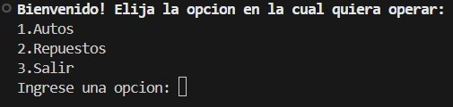

## Talento_Tech_Python

## Proyecto final integrador: taller de autos

## Descripción
Este programa facilita la gestión de un taller mecánico, permitiendo administrar de manera eficiente autos y repuestos mediante una base de datos SQLite. Ofrece funcionalidades como:

- Gestión de Autos: Registro, consulta, modificación y eliminación de autos con información detallada (patente, marca, modelo, año, chasis, cantidad de puertas, etc.).
- Gestión de Repuestos: Control de stock de repuestos con datos como nombre, descripción, cantidad disponible, precio y categoría (interior o exterior).
- Reportes: Identificación de repuestos con bajo stock para optimizar la reposición.
- Validaciones: Verificación de formatos correctos (ej. patente, chasis) y restricciones de datos para asegurar la calidad de la información ingresada.
- El proyecto utiliza Python y módulos como sqlite3 y colorama para crear una experiencia interactiva y visualmente amigable en consola. 

## Función principal: pedir_patente(agregar: bool)
Esta funcion se encarga de pedir la patente del auto y validarla. Dependiendo la llamada de la funcion, se agregará o no un auto.
- agregar: si esta en True, significa que se va a agregar un auto. Si está en False, se va a modificar o a eliminar uno.

~~~ Python (lenguaje en el que esta escrito)

patente = pedir_patente(True) //llamada de la funcion para agregar un auto

patente = pedir_patente(False) //llamada de la funcion para modificar o eliminar un auto

def pedir_patente(agregar: bool):
    """
    Solicita una patente de auto al usuario y valida su formato.

    Args:
        agregar (bool): Indica si se está agregando un nuevo auto.

    Returns:
        str or bool: La patente del auto (si es válida) o False si no se encuentra el auto.
    """
    if agregar:
        conexion = sqlite3.connect('curso_caba/taller_fmb.db')
        cursor = conexion.cursor()

        cursor.execute("SELECT patente FROM Autos") #obtener todas las patentes existentes en la tabla Autos
        patentes_existentes = {row[0] for row in cursor.fetchall()}

        while True:
            patente = input("Ingrese la patente del auto: ").strip().upper().replace(" ", "")

            if re.fullmatch(r"[A-Z]{3}\d{3}", patente): #validar formato de 6 caracteres (AAA000)
                if patente in patentes_existentes:
                    print(Fore.RED + "Error. La patente ya existe en la base de datos. Intente nuevamente.\n" + Style.RESET_ALL)
                    continue
                conexion.close()
                return patente

            if re.fullmatch(r"[A-Z]{2}\s?\d{3}\s?[A-Z]{2}", patente): #validar formato de 7 caracteres (AA000AA)
                if patente in patentes_existentes:
                    print(Fore.RED + "Error. La patente ya existe en la base de datos. Intente nuevamente.\n" + Style.RESET_ALL)
                    continue
                conexion.close()
                return patente

            print(Fore.RED + "Error. Formato inválido. Intente nuevamente.\n" + Style.RESET_ALL)
    else:
        while True:
            patente = input("Ingrese la patente del auto: ").strip().upper().replace(" ", "")

            if re.fullmatch(r"[A-Z]{3}\d{3}", patente): #validar formato de 6 caracteres (AAA000)
                break

            if re.fullmatch(r"[A-Z]{2}\s?\d{3}\s?[A-Z]{2}", patente): #validar formato de 7 caracteres (AA000AA)
                break

            print(Fore.RED + "Error. Formato inválido. Intente nuevamente.\n" + Style.RESET_ALL)

        conexion = sqlite3.connect('curso_caba/taller_fmb.db')
        cursor = conexion.cursor()

        cursor.execute("SELECT * FROM Autos")
        registros = cursor.fetchall()
        conexion.close()

        for a in registros:
            if patente == a[1]:
                return a
        return False
~~~
